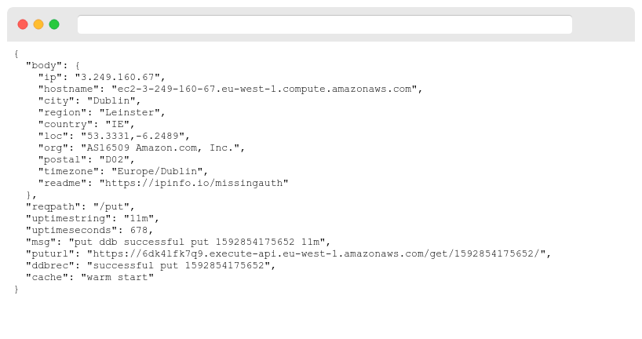

aws-lambda-xray-node
====================

A demo app to show how AWS X-Ray instrumentation works with Node.JS 12 with HTTP and AWS SDK calls. The stack creates an API GW, Node.JS Lambda to handle requests, a Lambda Layer containing X-Ray and other libraries and a DynamoDB table to store results.

The HTTP and DynamoDB requests will be traced from the X-Ray console;

You can deploy the app to your AWS account using the AWS SAM CLI. Run 'sam build' and 'sam deploy -g' in the directory. After the deployment, the API Gateway URL you can query with curl or your browser is shown. 

